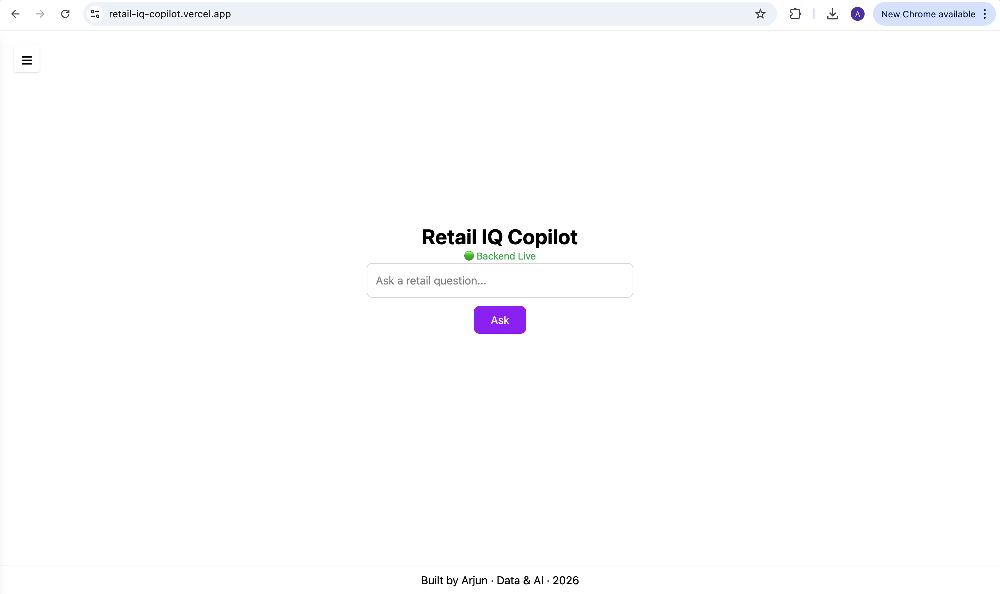
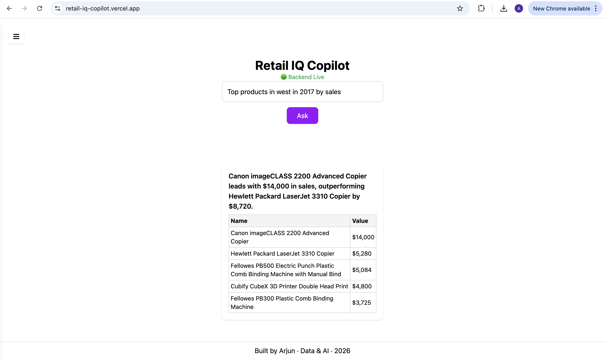

# Retail IQ Copilot

> An AI-powered analytics system that converts natural language questions into executable SQL queries and returns 
> structured, decision-ready insights on top of retail data.

**Live Demo:** [retail-iq-copilot.vercel.app](https://retail-iq-copilot.vercel.app/)  
**Author:** Arjun A N

> ⚠️ **Note on working:** Backend runs locally. Hence server activation will be needed for working. 
---

## 🚀 Overview

Most analytics tools are dashboard-driven.  
They require users to know where to look, what to filter, and how to interpret data.

Retail IQ Copilot removes that friction.

Users can simply ask:
- “Top 5 products in west in 2017 by sales”
- “Which category grew the fastest in 2017?”

The system translates that into SQL, executes it, and returns clean insights.

This is the shift from:
> dashboards → AI-assisted decision systems

---

## 🖥️ Project Preview

---

## ✨ Key Features

- 🔍 **Natural Language → SQL Conversion**  
  Converts plain English queries into structured SQL

- 📊 **Business-Ready Insights**  
  Returns clean summaries along with structured data

- 🟢🔴 **Live Backend Status Indicator**  
  - Green → Server is online  
  - Red → Server is offline  

- ℹ️ **Interactive Info Panel**  
  - Explains what the project does  
  - Provides quick, clickable sample queries to get started instantly  

- ⚡ **Fast API Responses**  
  Lightweight FastAPI backend with efficient query execution  

---

## 🧠 The Problem

Business teams depend heavily on analysts for routine queries:

- Top-performing products  
- Regional performance  
- Category trends  

This creates:
- delays in decision-making  
- repeated manual effort  
- lack of self-serve analytics  

---

## 💡 Solution

Retail IQ Copilot enables **self-serve analytics** by:

- understanding natural language queries  
- converting them into SQL  
- executing queries on structured data  
- returning concise, actionable insights  

---

## ⚙️ How it works

### 1. Query Understanding
Extracts:
- metrics (sales, profit, growth)
- filters (region, year)
- grouping (product, category)

---

### 2. SQL Generation
Uses **rule-based logic** instead of pure LLM generation.

Why:
- prevents invalid SQL  
- ensures schema alignment  
- avoids hallucinations  

---

### 3. Query Execution
- Runs on MySQL (Superstore dataset)
- Returns structured results

---

### 4. Data Processing
- Cleans and formats output  
- Ensures consistency before insight generation  
- Superstore Dataset https://www.kaggle.com/datasets/vivek468/superstore-dataset-final

---

### 5. Insight Generation
- LLM (Meta Llama 3) converts results into readable summaries  
- Fallback logic ensures stable output  

---

## 🏗️ Architecture
- User Query
- FastAPI (/ask endpoint)
- Intent Parsing
- SQL Generation (rule-based)
- MySQL Execution
- Data Cleaning
- Insight Generation (LLM)
- JSON Response

---

## 📌 Example Queries

### Basic
- Top 5 products by sales  
- Bottom 3 products by profit  

### Category
- Best performing category  
- Top categories by sales  

### Regional
- Top products in west by sales  
- Best category in central region  

### Time-Based
- Top categories in 2017  
- Best products in 2016  

### Growth
- Which category grew the fastest in 2017  
- Which category declined the most in 2016  

---

---

### Sample Output

---

## 🔌 API Usage

**Endpoint:**
GET /ask?question=<your_query>

**Example:**
http://127.0.0.1:8000/ask?question=top%205%20products%20by%20sales

---

## 🛠️ Tech Stack

| Layer | Technology |
|------|-----------|
| Backend | FastAPI |
| Query Engine | Python |
| Database | MySQL |
| LLM | Meta Llama 3 (free version, running locally)|
| Dataset | Superstore Dataset https://www.kaggle.com/datasets/vivek468/superstore-dataset-final |

---

## ⚖️ Design Decisions

### 1. Rule-based SQL generation
LLMs are not reliable for direct SQL execution.

This system uses deterministic SQL construction to ensure:
- valid queries  
- predictable results  

---

### 2. Separation of concerns

- Python → logic & execution  
- LLM → summarization  

This prevents incorrect calculations.

---

### 3. Controlled flexibility

Supports flexible queries within:
- known schema  
- defined patterns  

Prioritizes reliability over unrestricted input.

---

## ⚠️ Limitations

- Schema-specific (Superstore dataset)  
- Limited support for complex multi-metric queries  
- Relies on predefined parsing rules  
- LLM output phrasing may vary  

---

## 🔮 Future Improvements

- Multi-metric comparisons  
- Query caching  
- Dashboard enhancements  
- Cloud deployment (AWS/GCP)  
- Support for dynamic schemas  

---

## 🌍 Real-World Applications

- Self-serve BI tools  
- Natural language interfaces over data warehouses  
- Internal analytics copilots  

---

## 👤 Author

**Arjun A N**
[GitHub](https://github.com/Arjunn28) · [Live Demo](https://retail-iq-copilot.vercel.app/) · [LinkedIn](https://www.linkedin.com/in/arjun-an/)